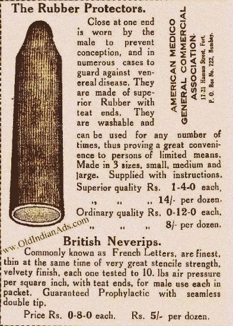
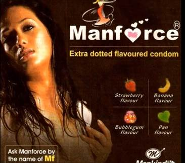

# Condom Ads: A Commentary
>Disclaimer: Might have wild claims, please ignore. Storing it for the archive.

## Introduction
Public sector condoms appeared on the market in the late 1960s when Hindustan Latex Corporation in Kerala was established to manufacture the Nirodh condom. At this time, condoms were privately manufactured and sold at high prices, it was accessible at a cost of 25 paise by a few wealthier populations while population growth rate was highest among the lower income groups.

The Indian Institute of Management (IIM) team suggested to the government to import condoms and sell them at 5 paise per condom which was affordable to the average Indian. Through funding from USAID, SIDA, and the Ford Foundation, the Indian government then imported 400 million condoms in 1968.

The Indian government started distributing condoms free of cost through family planning clinics and community workers, and at subsidized prices through community-based distributors and post offices under the depot holder scheme.

# Nirodh
In order to further improve access to condoms, the Government launched the **Nirodh Marketing Program in 1968**; through the Nirodh Marketing Program in March 1972, it was estimated that monthly average use of condoms was up to 7 million pieces.

"To increase the acceptability of condom – for both men and women – there is a need to create a positive image for their use. It will definitely prevent unwanted pregnancies and sexually transmitted diseases," Kumar noted.

Experts cite social stigma and a lack of privacy at condom-selling stores as reasons for a decline in the contraceptive use. Also, in rural areas, sexual health and issues related to intercourse are not discussed openly and pre-marital sex is frowned upon by elders despite young people engaging in it frequently.

Another likely explanation for the abjectly poor use of condoms in India is social awkwardness. Thanks to the stigma around sex in India, buying condoms in India can in itself be an embarrassing task. While the stigma may be easier to deal with in metropolitan cities, in towns and villages, the situation is starkly different. Till now, the most significant barriers for this campaign are- lack of privacy in stores and social stigma associated with condom use.

The government recently launched an online service to distribute condoms. The initiative has elicited a good response, with nearly one million condoms ordered so far. Experts say the high number of people ordering condoms online is proof that most Indians feel embarrassed to buy contraceptives from a store. Similarly, a 2005 study called “Linkages between masculinity and HIV/AIDS in North India”, conducted by students of the University of North Carolina, found that “masculine ideals of sexual conquest, experimentation, and entitlement” are major contributing factors to risky sexual behaviour in India. The study noted that of 75 respondents, some men intentionally ignored information about STIs in order to maintain a sense of normalcy.

Other important aspects that discourage condom use — and work in tandem with social stigma — are personal reluctance, prevailing moral norms and taboos. 

## Analysis of an Ad
 

### Colours used**
The ad has red and yellow, demonstrating warm hues. Red and yellow have an uncommon place in Indian culture. Red is dynamic and continually breathing flame according to the spectator. It instigates fear and is the shading related with a standout amongst the most loved goddesses in Hindu folklore – Durga. Her red hot picture is improved by her red tongue and relatively red eyes. Red likewise remains for virtue and is the favored shading for a lady's article of clothing. Red has a profound importance in the Indian mind. It celebrates the joining between two individuals and is unmistakably originating from from the wedding, where the lady of the hour is decked in splendid tones of red to the red tikka that she decorates after the wedding as an indication of her responsibility. It is maybe simple to perceive any reason why red likewise symbolizes ripeness and thriving. It is the shade of the ripe dirt that procures gathers and better lives and is utilized broadly in petition functions and contributions. What's more, India could scarcely be commended as the place that is known for flavors without its most feisty fixing — chilies. And keeping in mind that red symbolizes fruitfulness and virtue, it additionally indicates a specific erotic nature and requests positive vitality. Turmeric, while being utilized for cooking in both the north and the south, is likewise utilized in services offering petitions and relational unions. Yellow symbolizes holiness and is a basic home grown fixing connected on the body and face by ladies in the subcontinent. In a nation saturated with religious convictions, the cause of most colours lies in the forces and legendary existences of its divine beings.

### Depiction of couple
The couple is standing on a beach at a time that is close to sunset. . The clothes they are wearing are baggy(taboo of the body) but easy to maneuver out of. The beach invokes humidity and warmth as an image. The same feelings are associated with sex, bleeding into adjectives like steamy sex and hot sex. The need to suggest the context in as many ways as possible is very apparent. Pleasure was the taboo here. But it still represents the pleasure in a sexual act but through a suggestion of a couple. This tendency was then taken forward in time where pleasure became the main selling point in many adverts. The conservativeness was the result of governmental influence.

### Fonts used
The ads of the time used bold text or straight. The italics were used to depict either something off the beaten path or to suggest some mischievous contexts. The word ‘Nirodh’ meaning stop is in bold relaying a certain strength and reliability. The focus is the diseases here, which has since been dropped because of its general unpleasantness. There is an attempt to blend the text of the features into the background, revealing the hesitation behind making pleasure the focus of the product rather than the function parts of the product.

### Social Taboos
The condom manufacturers have tried to change the stigma around condoms in many ways in the past. In the 1930s this advt that ran on print media about condoms was largely scientific and not very pleasure-centric. the technical parts of the product are highlighted, the visuals are nominal and are reminiscent of product drawings, the language is scientific

In late **1980s** several TV commercial were developed to create awareness about ‘Nirodh’, however, the message from these advertisements was not clear like what is condom, who use it, where to get it or distributed free of cost.

# The 90s
In **1991** the KamaSutra brand condom was introduced and the brand advertised their product with erotic images of Bollywood actors, linking condoms to pleasure for the first time. Also, Zaroor condoms used funny taglines to catch eyeballs

Using the taboo around sex by talking about it in the same naughty conspirational way that is typical of that time while also poking fun at that attitude toward sex. Making fun in rhymes became a benign path of addressing the issue and eliminated the possibility of a backlash. Also the motivation to not become a father is important, using the kind of language that a male engaging in pre-marital or extra-marital sex might speak. This shows the shifting of the user from couples

In March **2008**, BBC World Service Trust launched a campaign about condoms to being a “real man”. Further, they launched the ‘[Condom Ringtone](https://www.youtube.com/watch?v=FzT-vZ7e94Q)’ aimed to engage people on a taboo topic.

This went on in many ways, in some places targeting the awkwardness of asking for a condom in the first place. Understanding the journey of having sex, the brands have identified the stress point of asking for condoms to pharmaceutical stores

 

By providing readymade abbreviations that both the customer and the pharmacist can use as a code, it removed one more barrier. 

 

  
## Other Campaigns dealing with stigma
	- [[Balbir Pasha: https://economictimes.indiatimes.com/brand-equity/whos-this-balbir-pasha/articleshow/34297026.cms?from=mdr]]